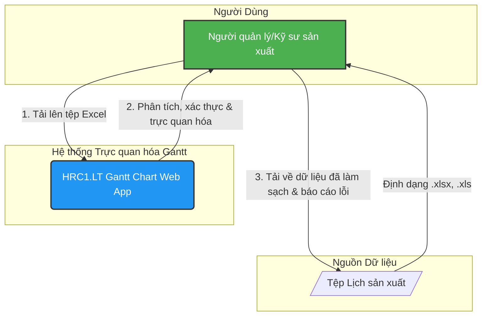
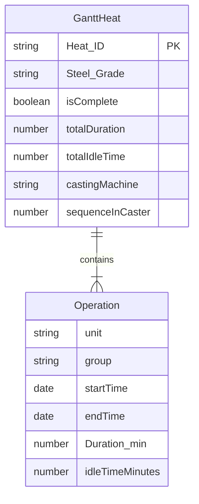

# HRC1.LT Gantt Chart - Trực quan hóa Lịch sản xuất Thép

Phiên bản 1.0.0

## 1. Tổng quan

**HRC1.LT Gantt Chart** là một ứng dụng web chuyên dụng được thiết kế để trực quan hóa lịch sản xuất thép phức tạp từ các tệp Excel. Hệ thống cho phép người quản lý sản xuất, kỹ sư và các bên liên quan dễ dàng tải lên, xác thực và phân tích dữ liệu sản xuất thông qua một biểu đồ Gantt tương tác.

Mục tiêu chính của hệ thống là chuyển đổi dữ liệu thô từ bảng tính thành một giao diện đồ họa rõ ràng, giúp nhận diện nhanh chóng các luồng sản xuất, điểm nghẽn, sự chồng chéo và hiệu suất tổng thể của dây chuyền.

## 2. Tóm tắt Kiến trúc

Kiến trúc hệ thống được xây dựng theo mô hình **Client-Side Rendering (CSR)** với Next.js, tập trung vào việc xử lý và hiển thị dữ liệu nặng về mặt tính toán ngay trên trình duyệt của người dùng.

### Sơ đồ Ngữ cảnh (C4 Context Diagram)

Sơ đồ này mô tả hệ thống và các tương tác chính của nó.



### Luồng Kiến trúc

1.  **Người dùng** (Production Planner/Engineer) chuẩn bị tệp lịch sản xuất ở định dạng Excel.
2.  Người dùng truy cập **ứng dụng web** và sử dụng chức năng tải tệp lên.
3.  Ứng dụng web (Next.js/React) nhận tệp và sử dụng thư viện `xlsx` để **phân tích (parse)** dữ liệu phía client.
4.  Một **bộ xác thực (Validator)** tùy chỉnh sẽ xử lý logic nghiệp vụ: chuẩn hóa đơn vị, tính toán thời gian qua đêm, xác định thứ tự mẻ theo ca sản xuất (08:00 - 07:59).
5.  Dữ liệu hợp lệ được chuyển đến **component biểu đồ Gantt (D3.js)** để vẽ và hiển thị.
6.  Các lỗi hoặc cảnh báo được thu thập và hiển thị riêng biệt để người dùng có thể rà soát và sửa chữa.

## 3. Ngăn xếp Công nghệ (Tech Stack)

| Lĩnh vực              | Công nghệ                                                              | Lý do lựa chọn                                                         |
| --------------------- | ---------------------------------------------------------------------- | ----------------------------------------------------------------------- |
| **Frontend Framework**| [Next.js](https://nextjs.org/) (App Router) & [React](https://reactjs.org/) | Cung cấp cấu trúc mạnh mẽ, tối ưu hiệu suất và trải nghiệm người dùng.   |
| **UI Components**     | [ShadCN/UI](https://ui.shadcn.com/) & [Radix UI](https://www.radix-ui.com/) | Thư viện component dễ tùy biến, hiện đại và đảm bảo khả năng truy cập. |
| **Styling**           | [Tailwind CSS](https://tailwindcss.com/)                               | Framework CSS linh hoạt giúp xây dựng giao diện nhanh chóng và nhất quán. |
| **Data Visualization**| [D3.js](https://d3js.org/)                                               | Thư viện mạnh mẽ để tạo các biểu đồ tùy chỉnh và tương tác cao.       |
| **Excel Parsing**     | [SheetJS (xlsx)](https://sheetjs.com/)                                 | Thư viện phổ biến và hiệu quả để đọc và xử lý tệp Excel trên client.   |
| **Date & Time**       | [date-fns](https://date-fns.org/)                                      | Thư viện nhỏ gọn, hiện đại để thao tác với đối tượng Date.           |
| **Ngôn ngữ**          | [TypeScript](https://www.typescriptlang.org/)                          | Tăng cường chất lượng mã nguồn và giảm lỗi với hệ thống kiểu tĩnh.        |
| **Icons**             | [Lucide React](https://lucide.dev/)                                    | Bộ icon gọn nhẹ, nhất quán và dễ sử dụng.                             |

## 4. Yêu cầu Hệ thống

-   **Node.js**: `v20.x` hoặc mới hơn.
-   **npm** (hoặc `yarn`, `pnpm`).
-   **Trình duyệt web**: Phiên bản mới nhất của Chrome, Firefox, Safari, hoặc Edge.

## 5. Biến môi trường

Hiện tại, hệ thống không yêu cầu biến môi trường nào để hoạt động ở chế độ local. Tệp `.env` có thể để trống.

```
# .env

# Không có biến môi trường nào được yêu cầu cho việc chạy local.
```

## 6. Cài đặt Local (Quickstart)

Thời gian dự kiến: **< 5 phút**.

1.  **Clone the repository:**

    ```bash
    git clone <repository-url>
    cd <repository-folder>
    ```

2.  **Install dependencies:**

    Sử dụng `npm` để cài đặt tất cả các gói cần thiết từ `package.json`.

    ```bash
    npm install
    ```

    *   **Verification:**
        Kiểm tra xem thư mục `node_modules` đã được tạo và không có lỗi nghiêm trọng nào trong quá trình cài đặt.

3.  **Run the development server:**

    Lệnh này sẽ khởi động ứng dụng Next.js ở chế độ phát triển.

    ```bash
    npm run dev
    ```

    *   **Verification:**
        Mở trình duyệt và truy cập [http://localhost:9002](http://localhost:9002). Bạn sẽ thấy giao diện chính của ứng dụng.

## 7. Build & Chạy ứng dụng

-   **Chạy chế độ phát triển (Development):**

    ```bash
    npm run dev
    ```

    Ứng dụng sẽ tự động tải lại khi có thay đổi trong mã nguồn.

-   **Build cho Production:**

    Lệnh này sẽ tạo một phiên bản tối ưu hóa của ứng dụng trong thư mục `.next`.

    ```bash
    npm run build
    ```

-   **Chạy chế độ Production:**

    Sau khi build, bạn có thể khởi động server production.

    ```bash
    npm run start
    ```

## 8. Tổng quan API

Hệ thống này là một ứng dụng **client-side hoàn toàn** và không có API backend. Toàn bộ logic xử lý dữ liệu (phân tích tệp, xác thực, vẽ biểu đồ) đều được thực hiện trên trình duyệt của người dùng.

## 9. Mô hình Dữ liệu (Data Model)

Hệ thống xử lý dữ liệu qua nhiều giai đoạn với các cấu trúc khác nhau.

### Sơ đồ quan hệ thực thể (ERD)



### Các Interfaces chính (`src/lib/types.ts`)

-   `ExcelRow`: Đại diện cho một hàng dữ liệu thô ngay sau khi được phân tích từ tệp Excel.
-   `Operation`: Đại diện cho một công đoạn sản xuất đã được xử lý và chuẩn hóa.
-   `GanttHeat`: Đại diện cho một mẻ thép hoàn chỉnh, chứa một danh sách các `Operation` và các thông tin metadata đã được xác thực, sẵn sàng để hiển thị.

## 10. Các Tính năng / Module chính

-   **File Uploader (`src/components/file-uploader.tsx`):**
    -   Cho phép người dùng tải lên tệp Excel (`.xlsx`, `.xls`, `.csv`).
    -   Hỗ trợ kéo-thả (drag-and-drop).
    -   Kích hoạt quá trình xử lý dữ liệu khi có tệp mới.

-   **Excel Parser (`src/lib/excel-parser.ts`):**
    -   Đọc dữ liệu từ tệp Excel bằng `SheetJS`.
    -   Chuẩn hóa tiêu đề cột (hỗ trợ cả Tiếng Việt và Tiếng Anh).
    -   Chuyển đổi các định dạng thời gian và ngày tháng của Excel thành chuỗi chuẩn.
    -   Loại bỏ các hàng giữ chỗ hoặc hàng trống.

-   **Validator (`src/lib/validator.ts`):**
    -   **Module cốt lõi của hệ thống.**
    -   Nhóm các hàng dữ liệu theo `Heat_ID`.
    -   Xác thực quy trình sản xuất (ví dụ: `BOF` phải có trước `LF`).
    -   Xử lý logic thời gian qua đêm.
    -   **Tính toán `sequenceInCaster` dựa trên ca sản xuất (08:00 - 07:59).**
    -   Tính toán thời gian chờ (`idleTime`) giữa các công đoạn.
    -   Tách riêng dữ liệu hợp lệ và danh sách các lỗi/cảnh báo.

-   **Gantt Chart (`src/components/gantt-chart.tsx`):**
    -   Vẽ biểu đồ Gantt bằng D3.js dựa trên dữ liệu `GanttHeat`.
    -   Áp dụng logic màu sắc cố định cho từng máy đúc.
    -   Hiển thị nhãn và tooltip chi tiết.
    -   Xử lý tương tác người dùng (hover, click) để làm nổi bật mẻ thép và hiển thị đường nối.
    -   Tự động điều chỉnh kích thước và bố cục theo màn hình.

-   **Error Display (`src/components/validation-errors.tsx`):**
    -   Hiển thị danh sách các lỗi và cảnh báo một cách rõ ràng, có thể thu gọn.

## 11. Ghi chú về Hiệu suất & Khả năng mở rộng

-   **Hiệu suất**: Vì toàn bộ quá trình xử lý diễn ra trên client, hiệu suất phụ thuộc vào sức mạnh của máy tính người dùng và kích thước tệp Excel. Với các tệp chứa hàng nghìn dòng, quá trình phân tích và vẽ biểu đồ có thể mất vài giây.
-   **D3.js Optimization**: Logic vẽ biểu đồ đã được tối ưu bằng cách chỉ vẽ lại khi dữ liệu thay đổi. Tương tác (hover, click) chỉ cập nhật thuộc tính CSS/SVG thay vì vẽ lại toàn bộ, đảm bảo độ mượt mà.
-   **Khả năng mở rộng**:
    -   Hệ thống hiện không có backend, nên không có vấn đề về khả năng mở rộng phía server.
    -   Để hỗ trợ các tệp lớn hơn (>10MB) hoặc xử lý đồng thời cho nhiều người dùng, kiến trúc cần được nâng cấp: chuyển logic phân tích và xác thực sang một API backend (ví dụ: sử dụng Node.js, Python) để giảm tải cho client.

## 12. Hướng dẫn Bảo mật

-   **Không có Dữ liệu phía Server**: Dữ liệu từ tệp Excel chỉ tồn tại trong bộ nhớ của trình duyệt người dùng và không được gửi đến bất kỳ máy chủ nào. Điều này đảm bảo tính riêng tư và bảo mật cho dữ liệu sản xuất.
-   **Dependencies**: Cần thường xuyên kiểm tra và cập nhật các gói npm để vá các lỗ hổng bảo mật đã biết. Sử dụng `npm audit` để kiểm tra.

## 13. Giám sát, Ghi log & Quan sát

-   **Ghi log lỗi phía Client**: Các lỗi trong quá trình xử lý tệp được bắt lại và hiển thị trực tiếp trên giao diện cho người dùng. Lỗi nghiêm trọng cũng được ghi lại vào Console của trình duyệt.
-   **Giám sát (Monitoring)**: Hiện tại, không có công cụ giám sát nào được tích hợp. Để theo dõi hiệu suất và lỗi trong môi trường production, có thể tích hợp các công cụ như Sentry, LogRocket, hoặc New Relic Browser.

## 14. Hướng dẫn Triển khai (CI/CD)

Hệ thống này là một ứng dụng tĩnh Next.js và có thể được triển khai trên bất kỳ nền tảng lưu trữ web tĩnh nào.

-   **Nền tảng đề xuất**: Vercel, Netlify, Firebase Hosting, AWS S3/CloudFront.
-   **Quy trình CI/CD với Vercel/Netlify**:
    1.  Kết nối repository Git (GitHub, GitLab, Bitbucket) với Vercel/Netlify.
    2.  Cấu hình build command: `npm run build`.
    3.  Cấu hình output directory: `.next`.
    4.  Mỗi khi có `git push` đến nhánh chính (ví dụ: `main`), Vercel/Netlify sẽ tự động build và triển khai phiên bản mới.

## 15. Troubleshooting & Runbook

| Vấn đề                                           | Nguyên nhân có thể                                        | Hành động khắc phục                                                                                                       |
| ------------------------------------------------ | --------------------------------------------------------- | -------------------------------------------------------------------------------------------------------------------------- |
| **Không thể tải lên tệp**                         | - Tệp không đúng định dạng (.xlsx, .xls, .csv).<br>- Tệp bị lỗi. | - Đảm bảo tệp có phần mở rộng chính xác.<br>- Thử mở và lưu lại tệp bằng Microsoft Excel.                               |
| **Ứng dụng bị treo hoặc rất chậm**                 | Tệp Excel quá lớn (hàng chục nghìn dòng).                 | - Chia nhỏ tệp thành các phần nhỏ hơn (ví dụ: theo tuần hoặc theo ngày).<br>- Chờ đợi quá trình xử lý hoàn tất. |
| **Nhiều lỗi "Thiếu cột bắt buộc"**                 | Tiêu đề cột trong tệp Excel không đúng với định dạng mong muốn. | - So sánh tiêu đề trong tệp của bạn với tệp mẫu (`sample-data.xlsx`).<br>- Đảm bảo các cột `Heat_ID`, `Steel_Grade`, `Unit`, `Start_Time`, `End_Time` tồn tại. |
| **Thứ tự mẻ (`sequenceInCaster`) không đúng** | Logic tính toán ca sản xuất (08:00) không khớp với thực tế. | - Mở tệp `src/lib/validator.ts` và điều chỉnh giờ bắt đầu ca trong hàm `getProductionDayKey`.                        |
| **Màu sắc trên biểu đồ không hiển thị**            | Tên máy đúc trong cột `Unit` không khớp với danh sách được định nghĩa. | - Kiểm tra dữ liệu cột `Unit` (ví dụ: `TSC1`, `BCM2`).<br>- Mở `src/components/gantt-chart.tsx` và cập nhật hằng số `CASTER_COLORS`. |

## 16. Cộng tác viên & Quản trị

-   **Chủ sở hữu hệ thống**: [Tên bộ phận/người chịu trách nhiệm]
-   **Nhà phát triển chính**: [Tên nhà phát triển/đội ngũ]
-   **Quy trình đóng góp**:
    1.  Tạo một `branch` mới từ nhánh `main`.
    2.  Thực hiện các thay đổi.
    3.  Tạo một `Pull Request` (PR) vào `main`.
    4.  Yêu cầu ít nhất một người review và phê duyệt trước khi merge.
